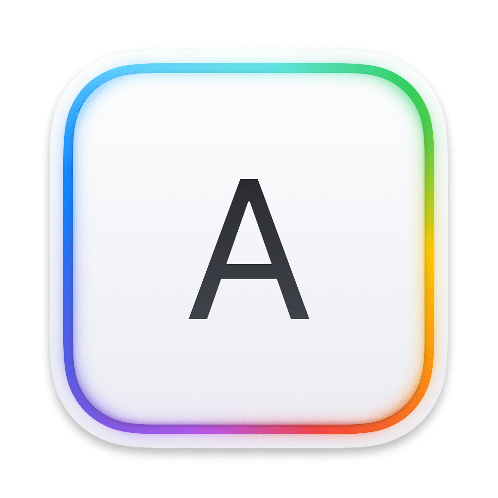

    

    
    
    

# KeyboardKit Binaries

This repository is used to host documentation for the latest public version of [KeyboardKit](https://keyboardkit.com). The documentation has getting-started guides, feature articles, code examples, etc.

## KeyboardKit Repository

The [KeyboardKit repository][Repository] has a Swift Package that can be used to create KeyboardKit-based keyboard apps for all major Apple platforms.

The repository has additional resources and a demo app that shows you how to set up and configure KeyboardKit.

## Contact

Feel free to reach out if you have questions or if you want to contribute in any way:

* Website: [keyboardkit.com][Website]
* E-mail: [info@keyboardkit.com][Email]
* Bluesky: [@keyboardkit.bsky.social][Bluesky]
* Mastodon: [@keyboardkit@techhub.social][Mastodon]

[Email]: mailto:info@keyboardkit.com
[Website]: https://keyboardkit.com
[Repository]: https://github.com/keyboardkit/keyboardkit
[Binaries]: https://keyboardkit.github.io/KeyboardKit-Binaries/
[Bluesky]: https://bsky.app/profile/keyboardkit.bsky.social
[Mastodon]: https://techhub.social/@keyboardkit
[Sponsors]: https://github.com/sponsors/danielsaidi
